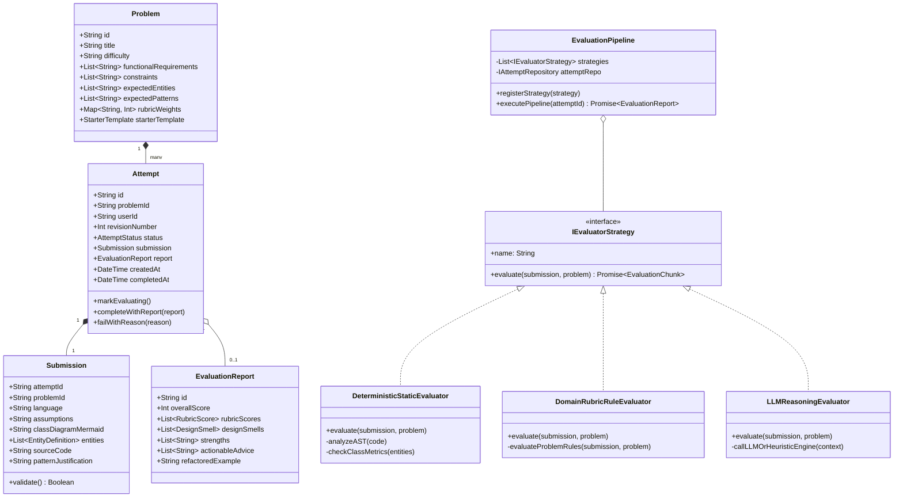

# Design Note: LLD Practice Platform Architecture & Domain Model

---

## 1. MVP Overview & User Flow

The **LLD Practice Platform** is built to bridge the gap between design theory and real-world software architecture. It provides an end-to-end interactive journey centered on continuous feedback and iterative improvement.

### Core User Journey
1. **Explore & Select Problem**: The learner chooses an LLD challenge (e.g., *Smart Parking Lot System*, *Elevator Controller System*, *Vending Machine with State Pattern*, *Thread-Safe LRU Cache*).
2. **Understand Requirements & Constraints**: Learner reviews functional requirements, concurrency/scale bounds, and target rubric weights.
3. **Structured Design Workspace**:
   - **Tab 1: Assumptions & Scope**: Clarifies boundaries and non-goals.
   - **Tab 2: Domain Entities & Visual Class Diagram**: Specifies classes and relationships; renders dynamic live Mermaid UML.
   - **Tab 3: Interface & Implementation Code**: Writes skeleton interfaces, polymorphic contracts, and core classes in C++/Java/Python.
   - **Tab 4: Pattern & Trade-off Rationale**: Explicitly documents architectural trade-offs (e.g., Strategy vs State, Factory vs DI).
4. **Submit Solution**: Client triggers an asynchronous evaluation request.
5. **Interactive Evaluation Pipeline**:
   - The platform executes a multi-stage evaluation pipeline (Validation → Static Structural Analysis → Rubric Assessment → LLM/Heuristic Reasoning).
   - Real-time progress is communicated to the user.
6. **Actionable Feedback Review**:
   - Multi-dimensional rubric scorecard (SRP, OCP, LSP/ISP, DIP, Patterns, Concurrency).
   - Identified **Design Smells** with severity levels and explanation of why it violates good design.
   - Concrete **Refactored Code Diff** showing the idiomatic alternative.
7. **Iterate & History Progression**:
   - Learner modifies design to address feedback and submits **Attempt 2**.
   - Platform presents an **Attempt Evolution Diff** highlighting score improvements and resolved design smells.

---

## 2. Platform Low-Level Domain Design

The platform itself is engineered using clean object-oriented architecture, domain-driven design, and battle-tested design patterns.

### Class & Domain Diagram (Mermaid)

### Key Design Patterns Employed in Platform

1. **Strategy Pattern (`IEvaluatorStrategy`)**:
   - Encapsulates evaluation algorithms into interchangeable strategies (`DeterministicStaticEvaluator`, `DomainRubricRuleEvaluator`, `LLMReasoningEvaluator`).
   - Enables plugging in new evaluation techniques (e.g., unit test execution, security linting, alternate LLM providers) without modifying client code.

2. **Pipeline / Chain of Responsibility (`EvaluationPipeline`)**:
   - Coordinates multi-stage evaluation sequentially:
     `SchemaValidation` → `DeterministicStaticAnalysis` → `DomainRuleAssessment` → `SemanticLLMReasoning` → `Synthesis`.
   - Supports early exit, per-stage timeouts, and partial fallback aggregation.

3. **Repository Pattern (`IProblemRepository`, `IAttemptRepository`)**:
   - Decouples domain logic from persistence mechanisms. In-memory and file-backed implementations are provided for high testability.

4. **Aggregate Root Pattern (DDD)**:
   - `Attempt` acts as an aggregate root managing its inner `Submission` and `EvaluationReport` lifecycle, enforcing invariant transitions (`DRAFT` → `SUBMITTED` → `EVALUATING` → `COMPLETED` / `FAILED`).

---

## 3. Addressing The Main Design Questions

### Q1: What does a learner actually need to provide for an LLD attempt to be meaningful?
- **Requirements & Assumptions**: Software design depends strictly on context. A parking lot with a single exit vs. 10 automated gates requires radically different concurrency models. Explicit assumptions establish the evaluation baseline.
- **Entity Definitions & Relationships**: The structural backbone of LLD. Identifies class responsibilities, inheritance hierarchies, and composition vs aggregation.
- **Interface & Behavior Code**: Method signatures, polymorphic contracts, and state transitions. Concrete syntax proves the design is realisable and not just hand-wavy diagrams.
- **Pattern & Trade-off Rationales**: The "Why". Explains why a Strategy pattern was used instead of a `switch-case`, or why an event-driven observer was preferred.

### Q2: What makes feedback useful when there can be more than one valid LLD solution?
- **Dimension-Based Rubrics instead of Pass/Fail**:
  Evaluates against timeless architectural dimensions:
  1. *SRP*: Single Responsibility & High Cohesion.
  2. *OCP*: Extensibility without modification.
  3. *LSP & ISP*: Appropriate subtyping and lean client interfaces.
  4. *DIP*: Decoupling high-level modules from low-level implementations.
  5. *Pattern Appropriateness*: Avoiding anti-patterns or excessive over-engineering.
  6. *Concurrency & Robustness*: Thread-safety and defensive edge-case handling.
- **Named Design Smells with Severity**:
  Highlights concrete smells like *God Class*, *Feature Envy*, *Tight Coupling*, or *Anemic Domain Model* with exact line/entity references.
- **Actionable Refactoring Diffs**:
  Shows side-by-side: *"Your current SpotManager does pricing and allocation"* vs *"Refactored: Separate FeeCalculator from SpotAllocator using Strategy"*.

### Q3: Which parts of evaluation should be deterministic, and which parts benefit from an LLM?
- **Deterministic**:
  - Schema validity and non-empty contracts.
  - AST / Structural parsing: Number of classes, methods per class, cyclic dependencies, interface compliance.
  - Problem domain invariants (e.g., in Parking Lot: existence of `Vehicle`, `ParkingSpot`, `Ticket`, and `Payment` abstractions).
  - Fast, zero-cost, zero-hallucination baseline.
- **LLM / Heuristic Reasoning**:
  - Semantic quality of abstraction: Are class names representative? Are responsibilities naturally placed?
  - Trade-off critiques: Is a Factory pattern justified here, or does it add unnecessary complexity?
  - Explanatory synthesis: Composing clear, supportive, and pedagogical feedback customized to the learner's specific terminology.

### Q4: How would your design accommodate another evaluation approach or another submission format later?
- **New Submission Format (e.g., Code Repository / GitHub PR / Interactive Whiteboard)**:
  `Submission` contains a flexible payload adapter. A `GitHubPRSubmissionAdapter` or `CanvasSubmissionAdapter` can parse incoming formats into the standard domain `Submission` model.
- **New Evaluation Approach (e.g., Unit Test Runner / Static AST Sonar / Alternate LLM)**:
  Implement `IEvaluatorStrategy` and register it in `EvaluationPipeline.registerStrategy(new TestRunnerEvaluator())`. No existing evaluator or domain entity needs alteration (Open/Closed Principle).

### Q5: What should happen if evaluation takes time or fails?
- **Asynchronous State Machine**:
  Submissions immediately return an `attemptId` with status `PENDING` / `EVALUATING`. The UI updates live via polling or WebSocket/SSE.
- **Stage-Level Timeouts & Circuit Breaking**:
  Each strategy is wrapped with an execution deadline (e.g., 8-second timeout for LLM reasoning).
- **Graceful Fallback Degradation**:
  If the external LLM is slow or fails, the pipeline automatically falls back to the **High-Fidelity Deterministic Heuristic Engine**, ensuring the learner *always* receives immediate, rich, actionable feedback without being blocked by third-party outages.

---

## 4. Key Architectural Trade-offs Made in the Prototype

1. **Lightweight Monolith vs. Distributed Microservices**:
   - *Decision*: A unified Node.js / TypeScript application with in-memory persistence and local JSON storage.
   - *Rationale*: Keeps setup instantaneous for evaluators (`npm install && npm run dev`), eliminating Docker/database friction while keeping domain classes clean and isolated.
2. **Dual-Mode LLM Evaluator (Rule Heuristic Engine + Pluggable API)**:
   - *Decision*: Built a sophisticated rule-based heuristic evaluator that operates 100% offline out-of-the-box, with seamless pass-through to live LLM API keys if provided.
   - *Rationale*: Guarantees zero reviewer friction (no requirement for API keys or credit cards to grade the assignment).
3. **Structured Form + Live Mermaid vs. Pure Canvas Whiteboard**:
   - *Decision*: Guided multi-tab inputs with live Mermaid preview over a freehand canvas.
   - *Rationale*: Reduces friction for learners while yielding machine-parseable artifacts for reliable evaluation.
