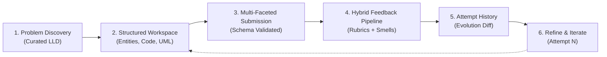

# Research Note: Low-Level Design (LLD) Practice & Evaluation Platform

---

## 1. Executive Summary & The Learner Problem

Low-Level Design (LLD) / Object-Oriented Design (OOD) is a critical software engineering competency evaluated heavily in product and tier-1 tech interviews (SDE-2 / Senior SDE). It tests an engineer's capability to translate ambiguous real-world domain requirements into maintainable, modular, extensible, and clean object-oriented architectures using SOLID principles and design patterns.

However, learners and practicing engineers face a painful pedagogical paradox:
- **Easy to start, nearly impossible to evaluate objectively**: A learner can draft an Elevator System, Parking Lot, or Vending Machine in an hour. But without senior engineering review, they cannot verify whether their class boundaries, responsibilities, coupling, or design pattern trade-offs are actually good or dangerously brittle.
- **The "LeetCode Illusion" fails in LLD**: In algorithmic problem solving (DSA), problems have deterministic I/O test cases (pass/fail). In LLD, **there is no single canonical answer**. A Parking Lot can validly use a Strategy pattern for spot allocation, an Observer pattern for display boards, or a State pattern for payment processing. Binary pass/fail checkers fail miserably here.
- **Fragmented practice medium**: Learners oscillate between freeform whiteboards (too abstract, lacks implementation rigor) and pure code editors (getting bogged down writing getters/setters and syntax instead of architectural trade-offs).

---

## 2. Research into Existing Tools & Approaches

To understand where current solutions fall short, we analyzed four primary channels learners currently rely on:

| Platform / Approach | Mode of Operation | Key Strengths | Critical Gaps for LLD Learners |
| :--- | :--- | :--- | :--- |
| **LeetCode / HackerRank** | Unit-test based code execution (e.g., "Design Underground System", "Design Leaderboard"). | Automated, instantaneous execution feedback. | Focuses on algorithmic time/space complexity and HashMaps rather than object modeling, SOLID principles, extensibility, or design patterns. |
| **Generic LLMs (ChatGPT / Claude)** | Ad-hoc chat prompt: "Review my Parking Lot design code". | Deep semantic reasoning and code explanation. | Suffers from hallucinated praise, lack of standardized rubric consistency, unstructured walls of text, and no progression/attempt tracking across revisions. |
| **Educational Video Platforms (YouTube / Udemy / Educative)** | Static reference solutions ("Grokking the Low Level Design"). | High quality reference diagrams and curated explanations. | Entirely passive consumption. The learner watches an expert solve it, experiencing the *illusion of competence* without active design practice. |
| **Peer / Mock Interviews (Pramp / Interviewing.io)** | Human-to-human verbal and whiteboard reviews. | Contextualized, interactive feedback on trade-offs. | Extremely high friction, expensive, unscalable, and dependent on the subjective bias or skill of the peer interviewer. |

---

## 3. Key Gaps Identified

Through our analysis, five structural gaps emerged in the current LLD learning landscape:

1. **Missing Multi-Faceted Submission Schema**:
   In reality, an LLD interview or real-world design review is not just raw code. It consists of:
   - *Assumptions & Scope Clarifications* (e.g., "Single entry vs multiple gates?", "Pre-booking supported?").
   - *Domain Entities & Relationships* (Class diagrams, aggregation vs composition).
   - *Interface Contracts & Behaviors* (Polymorphic methods, extension points).
   - *Design Decisions & Trade-off Rationales* (Why Strategy over inheritance? Why Factory?).
   Current tools accept only raw code or raw text, missing the multi-dimensional nature of LLD.

2. **Absence of Standardized, Explainable Evaluation Rubrics**:
   Learners receive generic praise or nitpicks on syntax rather than systematic evaluation across core engineering dimensions:
   - **SRP** (Single Responsibility & Cohesion)
   - **OCP** (Extensibility without modification)
   - **ISP & DIP** (Interface Segregation & Dependency Inversion)
   - **Pattern Appropriateness** (Avoiding under-engineering or over-engineering)
   - **State, Concurrency & Edge Cases** (Race conditions, validation)

3. **No Iterative Attempt Evolution / Refactoring Feedback**:
   Real design is an iterative process of refinement. When a learner makes a second attempt, existing tools treat it as an isolated event. Learners need to see: *"Did Attempt 2 successfully decouple the God Class spotted in Attempt 1? How did my OCP score improve?"*

4. **Failure to Distinguish Deterministic vs. Qualitative Evaluation**:
   Evaluating syntax or class presence does not need an expensive LLM, but evaluating architectural trade-offs cannot be done with regular expressions or AST linters alone. Systems need an intelligent hybrid pipeline.

---

## 4. Product Direction & MVP Scope

Our product hypothesis is simple:
> **An effective LLD practice platform must guide the learner through a structured thinking journey, evaluate their design across standardized architectural rubrics using a hybrid deterministic-reasoning pipeline, and track iterative progress across revisions.**

### The Core Learner Journey (Practice Loop)

### Core Design Principles for the MVP
1. **Low Friction, High Structure**: Pre-populated requirements, domain constraints, starter templates, and dynamic Mermaid UML visualization.
2. **Explainable, Actionable Feedback**: Rather than a vague numerical score, each evaluation provides:
   - Rubric dimension breakdown (0–100 with qualitative criteria).
   - Concrete **Design Smells** tagged with severity (e.g., God Class, Tight Coupling, Anemic Domain Model).
   - A **Refactored Code Diff / Architecture Snippet** demonstrating how to fix the smell.
3. **Resilient Hybrid Engine**: Deterministic AST/rule checking for structure + intelligent reasoning for trade-offs, backed by reliable fallbacks and asynchronous pipeline orchestration.
